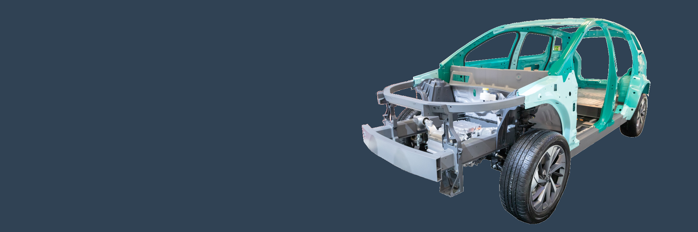

# The Chassis DSL for generating Code

[link to DSL docs]({{ site.baseurl }})

## Deployment Diagram (Chassis subprojects):

path: {{ site.chassisassetsgit }}/arch/drawio/Arch_Overview.drawio.svg

[comment]: # curlypercent  drawio path="assets/arch/drawio/Arch_Overview.drawio" page_number=0 height=650 percentcurly

